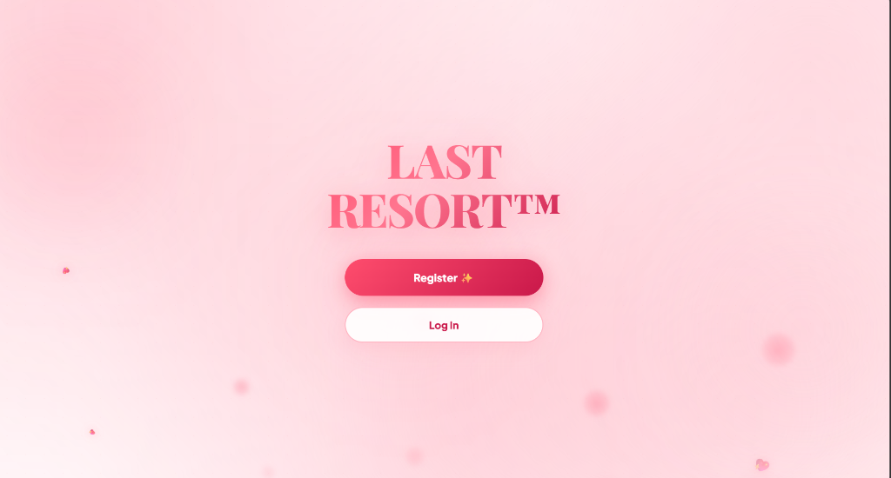
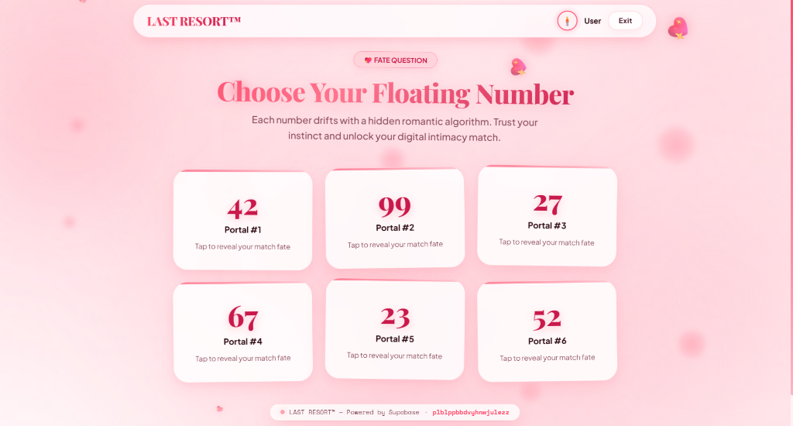
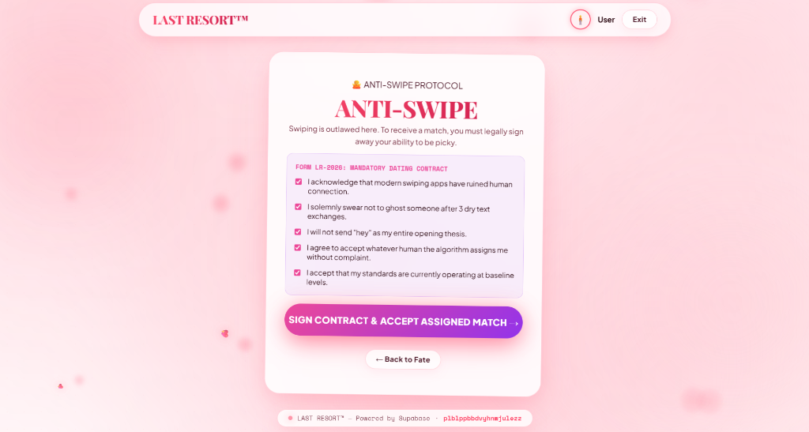
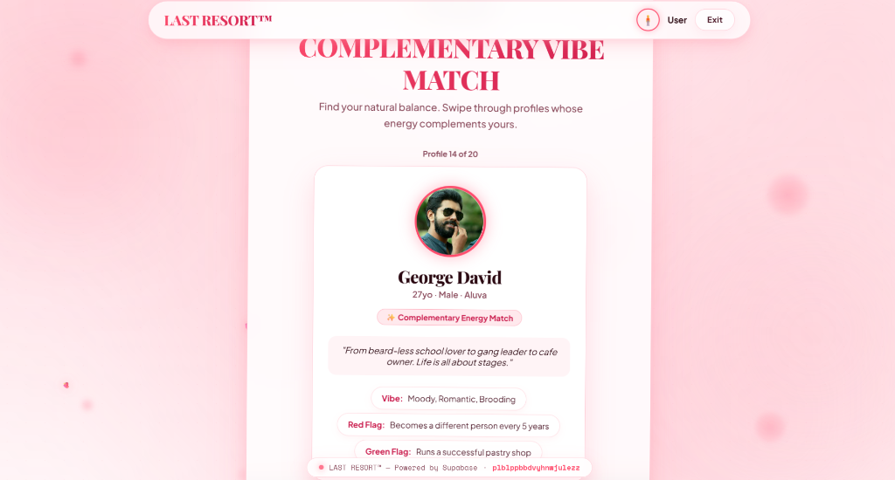

#  OUT OF OPTIONS — LAST RESORT™ 

> **The dating app you use when every other option has failed.**

🚀 **Live App**: [https://last-resort-rgbupo4dy-nova-036f.vercel.app/](https://last-resort-rgbupo4dy-nova-036f.vercel.app/)


## Basic Details
### Team Name: Nova


### Team Members
- Ishana Leny - Muthoot Institute of Technology and Science
- Shreddha Eldho - Muthoot Institute of Technology and Science

### Project Description
**OUT OF OPTIONS — LAST RESORT™** is a satirical, interactive dating web app that intentionally breaks traditional matchmaking logic.

Instead of helping users find compatible partners, the platform:
* Removes user control
* Introduces absurd decision systems
* Simulates "AI-driven matching" using chaotic logic
* Prioritizes humor, frustration, and unpredictability

The core idea is simple:
> *You don't choose your match. The system chooses your suffering.*

### The Problem (that doesn't exist)
Modern dating applications grant users far too much choice and control, leading to decision paralysis, infinite swiping, ghosting after three dry texts, and over-optimized, unrealistic romantic expectations.

### The Solution (that nobody asked for)
LAST RESORT™ solves choice fatigue by removing human choice entirely:
- **Legal Waiver Contracts**: Users legally surrender their right to be picky.
- **Randomized Algorithm Overrules**: 80% of user swipes result in system rejection or assignment to a completely different human candidate.
- **Sabotaged Chat Interaction**: Send buttons physically escape mouse cursors to prevent dry text openers ("Hey").
- **Scream Verification**: Candidate identities remain 100% hidden until the user screams into the microphone.

---

#### User Flow
```text
Landing Page
   ↓
"Find Me Someone"
   ↓
Fate Question (random entry point)
   ↓
One of 6 Dating Modes
   ↓
Match Result
   ↓
Exit OR Continue
   ↓
Profile / Chat / Compatibility
   ↓
Restart Loop
```

---

####  Landing Page
The entry point introduces the theme:
* "You have officially hit rock bottom."
* Disclaimer about damaged standards
* CTA: **FIND ME SOMEONE**

This sets the tone for a chaotic, self-aware experience.

---

####  The Fate Question
Users answer a **single meaningless question** with **6 options**.

Each option secretly maps to a different dating mode:
1. **The Opposite**
2. **Slow Dating**
3. **Uselessness Match**
4. **Anti-Swipe**
5. **Wheel of Terrible Decisions**
6. **Wheel of Fate**

The user is **not told which mode they selected**.

---

####  Dating Modes

##### 1.  The Opposite
Users define their ideal partner through 4–5 questions. The system inverts every preference and matches them with the exact opposite.
> *"We know exactly who NOT to show you."*

##### 2.  Slow Dating
An intentionally frustrating experience featuring extremely slow loading, delayed actions, partial reveals (one pixel at a time), and fake queues/approvals.
> *Every action feels unnecessarily difficult.*

##### 3.  Uselessness Match
A gamified "uselessness test" including microphone interaction (scream to increase volume), mini-games (kill a mosquito with cursor), and absurd behavioral questions. Calculates a **Uselessness Score (%)** and matches with someone equally useless.
> *"Together, you could waste 11.7 hours per day."*

##### 4.  Anti-Swipe
A Tinder-like interface with reversed logic (swipe right → rejected, swipe left → accepted, random algorithm overrides). Includes sarcastic system responses:
* *"Nice try."*
* *"You thought you had a choice?"*
* *"The algorithm has rejected your decision."*

##### 5.  Wheel of Terrible Decisions
A single random category decides compatibility (favorite fruit, sock preference, phone battery %, chai vs coffee).
> *"We have no other evidence that you'll get along."*

##### 6.  Wheel of Fate
Multiple wheels generate a "perfect match" across age, interests, personality, hobby, pet, and location, providing a fake compatibility score.
> *"We had to compromise on a few things. Mostly everything."*

---

####  Match System & Loop Mechanism
All modes (except Anti-Swipe) lead to a **Match Result Page** displaying profile preview, compatibility percentage, and absurd reasoning.

Users can:
* **Exit** → Return to landing
* **Continue** → Profile view, Chat interface with escaping send button, compatibility breakdown, and "Ask the algorithm" explanations.
* **Restart Loop** → Users can always "Try again" to return to the Fate Question. Each run gives a different experience.

---


## Technical Details
### Technologies/Components Used
- **Languages used**: JavaScript (ES6+), HTML5, CSS3 (animations, transitions, glassmorphic UI effects)
- **Frameworks used**: React 18 (component-based architecture), Vite 6, React Router DOM v6
- **Libraries used**: `@supabase/supabase-js` v2.45, Framer Motion, Lucide React, React Hot Toast
- **Backend & Database**: Supabase (PostgreSQL Database, Auth Service, Storage Buckets, Row Level Security Policies)
- **Features & Logic**: Randomization logic, state management (mode, choices, match), wheel spin animations, fake loading systems
- **Fixed Data Model**: Fixed dataset of ~20 pre-defined characters (Baahubali, Kabir Singh, Minnal Murali, Puli Murugan, Pooja Mathew, Meesha Madhavan, Ramanan, Appukuttan, Nagavalli, Glixon, Sona, Shammi, Malar Miss, George David, Clara, Dasan, Vijayan, Girirajan Kozhi, Sethumadhavan, Mary)

### Implementation
# Installation
1. Clone the repository and navigate to the application folder:
```bash
git clone https://github.com/user-attachments/assets
cd dateing_web
```

2. Install dependencies:
```bash
npm install
```

3. Set up environment variables in `.env`:
```env
VITE_SUPABASE_URL=https://your-supabase-project.supabase.co
VITE_SUPABASE_ANON_KEY=your-supabase-anon-key
```

4. Database Setup (Supabase SQL Editor):
Execute `database/00_complete_setup.sql` to create the `profiles` table, then execute `database/seed_20_movies.sql` to seed character profiles.

# Run
Start the Vite local development server:
```bash
npm run dev
```
Open `http://localhost:5173` in your browser.

### Project Documentation

# Screenshots (Add at least 3)

*LAST RESORT™ Landing Page Interface with Register and Log In options.*


*Fate Question Portals ("Choose Your Floating Number") mapping to hidden matchmaking algorithms.*


*Anti-Swipe Protocol Waiver (Form LR-2026: Mandatory Dating Contract) where users surrender control.*


*Complementary Vibe Match profile deck displaying character bio cards with energy vibes and flags.*

# Diagrams

*Detailed architecture and execution workflow map for OUT OF OPTIONS - LAST RESORT™.*

### 🎭 Design Philosophy & Goal
- **UX Storytelling over Functionality**: Intentionally breaks user expectations and mocks dating app algorithms using fake complexity for humor.
- **Goal**: Create a fully interactive, absurd, and memorable web experience that feels like a real product — but behaves like a joke.

### ⚠️ Disclaimer
This is a parody project. No actual matchmaking intelligence exists. Any emotional damage is purely coincidental.

### Project Demo
# Video
[Demo Video Link](https://drive.google.com/file/d/1tA-TyX_nr2Utg5tb0nalIboT8zo7Lphc/view?usp=sharing)
*Demonstrates mandatory contract signing, chaotic swipe overrides, escaping send button, and scream reveals.*

# Additional Demos
- **Live Vercel Web App**: [https://last-resort-rgbupo4dy-nova-036f.vercel.app/](https://last-resort-rgbupo4dy-nova-036f.vercel.app/)

## Team Contributions
- **Ishana Leny**: Core React Architecture, Anti-Swipe Tinder Deck, Supabase Integration, Escaping Send Button Sabotage Logic, PostgreSQL Movie Character Dataset.
- **Shreddha Eldho**: Vibe Match Harmonizer Quiz, Floating Glassmorphic Aesthetic Design System, Fate Machine Randomizer.

---
Made with ❤️ at TinkerHub Useless Projects 


